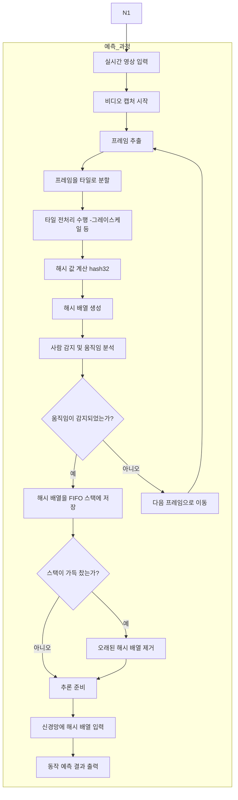

# Vision Tiles Hashing Neural Network (VTHNN) 

- 영상 타일 분할 Generate Tiles

- 해시 값 생성 Tiles Hashing 

- 타일 해시 배열 생성 Hash Array Formatter


`트레이닝 개요`

```c
#include <stdint.h>
#include <stdio.h>
#include <stdlib.h>
#include <string.h>
#include <opencv2/opencv.hpp>

#define DEFAULT_HASH_ARRAY_SIZE 1024

typedef struct
{
  uint32_t *hash_array;
  int       array_size;
  int       tile_rows;
  int       tile_cols;
  uint32_t  primenumber;
} TrainingData;

uint32_t hash32 ( const uint8_t *key, size_t len, uint32_t seed )
{
  uint32_t c1   = 0xcc9e2d51;
  uint32_t c2   = 0x1b873593;
  uint32_t r1   = 15;
  uint32_t r2   = 13;
  uint32_t m    = 5;
  uint32_t n    = 0xe6546b64;
  uint32_t hash = seed;

  const int       nblocks = len / 4;
  const uint32_t *blocks  = ( const uint32_t  *)( key );
  int             i;

  for ( i = 0; i < nblocks; i++ )
  {
    uint32_t k = blocks[i];
    k *= c1;
    k = ( k << r1 ) | ( k >> ( 32 - r1 ) );
    k *= c2;
    hash ^= k;
    hash = ( hash << r2 ) | ( hash >> ( 32 - r2 ) );
    hash = hash * m + n;
  }

  const uint8_t *tail = ( const uint8_t * )( key + nblocks * 4 );
  uint32_t       k1   = 0;

  switch ( len & 3 )
  {
    case 3:
      k1 ^= tail[2] << 16;
    case 2:
      k1 ^= tail[1] << 8;
    case 1:
      k1 ^= tail[0];
      k1 *= c1;
      k1 = ( k1 << r1 ) | ( k1 >> ( 32 - r1 ) );
      k1 *= c2;
      hash ^= k1;
  }

  hash ^= len;
  hash ^= ( hash >> 16 );
  hash *= 0x85ebca6b;
  hash ^= ( hash >> 13 );
  hash *= 0xc2b2ae35;
  hash ^= ( hash >> 16 );

  return hash;
}


void train_save ( const char *filename_train, TrainingData *data )
{
  FILE *file = fopen ( filename_train, "a" );
  if ( file == NULL )
  {
    printf ( "Error: Could not open training file.\n" );
    return;
  }

  for ( int i = 0; i < data->array_size; i++ )
  {
    fprintf ( file, "%u ", data->hash_array[i] );
  }
  fprintf ( file, "\n" );

  fclose ( file );
}


void process_frame ( cv::Mat frame, TrainingData *data )
{
  int h     = frame.rows / data->tile_rows;
  int w     = frame.cols / data->tile_cols;
  int index = 0;

  for ( int i = 0; i < data->tile_rows; i++ )
  {
    for ( int j = 0; j < data->tile_cols; j++ )
    {
      cv::Rect rect ( j * w, i * h, w, h );
      cv::Mat  tile = frame ( rect );

      cv::Mat gtile;
      cv::cvtColor ( tile, gtile, cv::COLOR_BGR2GRAY );

      int      len = gtile.total () * gtile.elemSize ();
      uint32_t v   = hash32 ( gtile.data, len, data->prime );

      data->hash_array[index++] = v;

      if ( index >= data->array_size )
      {
        /* OVERFLOW */
        return;
      }
    }
  }
}


void video_process ( const char *filename, int frames_max, TrainingData *data, const char *filename_train )
{
  cv::VideoCapture c ( filename );

  if ( !c.isOpened () )
  {
    printf ( "Error: Could not open video file.\n" );
    return;
  }

  int frame_count = 0;

  while ( frame_count < frames_max )
  {
    cv::Mat frame;
    c >> frame;

    if ( frame.empty () )
    {
      break;
    }

    process_frame ( frame, data );

    train_save ( filename_train, data );

    frame_count++;
  }

  cap.release ();
}

int main ( int argc, char **argv )
{
  if ( argc < 7 )
  {
    printf ( "Usage: %s [video-filename] <frame> <tile-rows> <tile-cols> <primenumber> <train-filename>\n", argv[0] );
    return -1;
  }

  const char *filename_video = argv[1];
  int         frames_max     = atoi ( argv[2] );
  int         tile_rows      = atoi ( argv[3] );
  int         tile_cols      = atoi ( argv[4] );
  uint32_t    primenumber    = ( uint32_t )atoi ( argv[5] );
  const char *filename_train = argv[6];

  TrainingData data;
  data.tile_rows   = tile_rows;
  data.tile_cols   = tile_cols;
  data.primenumber = primenumber;
  data.array_size  = tile_rows * tile_cols;
  data.hash_array  = ( uint32_t  *)malloc ( data.array_size * sizeof ( uint32_t ) );

  if ( data.hash_array == NULL )
  {
    /* OVERFLOW */
    return -1;
  }

  video_process ( filename_video, frames_max, &data, filename_train );

  free ( data.hash_array );

  return 0;
}

```


`추론초안`


